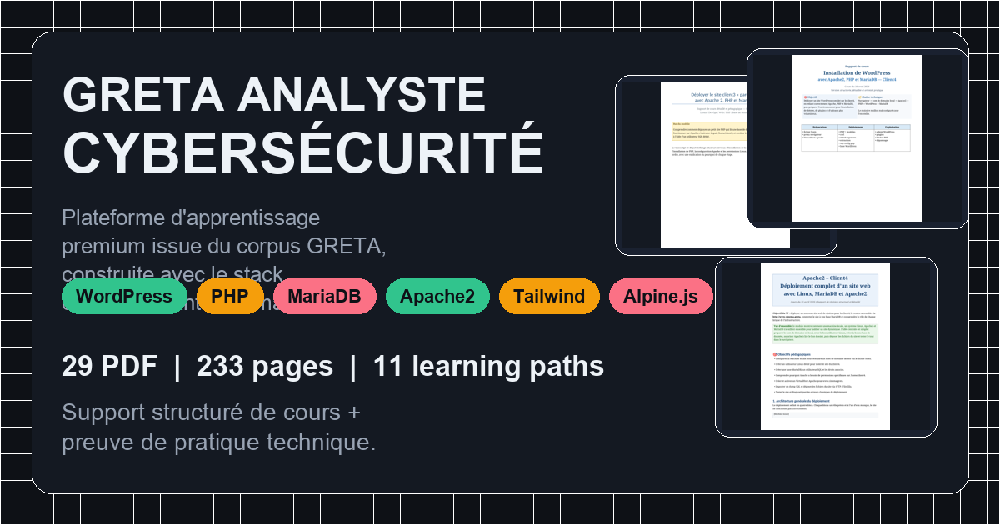
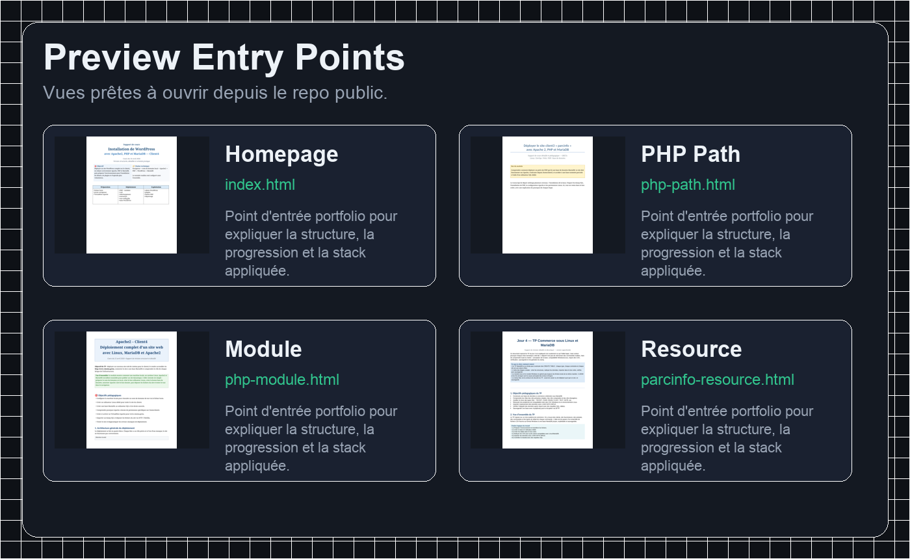
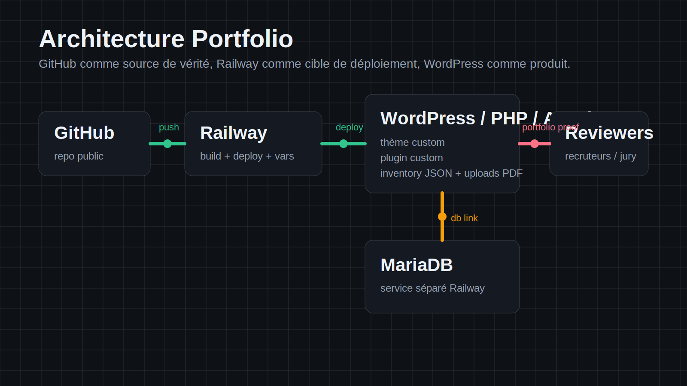

# GRETA ANALYSTE CYBERSÉCURITÉ



Plateforme d'apprentissage premium construite à partir d'un vrai corpus GRETA local, et projet vitrine qui assume l'usage appliqué de `WordPress`, `PHP`, `MariaDB`, `Apache2`, `Tailwind CSS`, `Alpine.js` et `HTML`.

## En une phrase
Ce repo transforme des supports de formation hétérogènes en produit portfolio lisible : une base documentaire structurée pour apprendre, et une démonstration publique de pratique technique construite avec le stack étudié pendant la formation.

## Ce qu'un reviewer doit comprendre immédiatement
- la matière source vient d'un vrai dossier GRETA local
- la plateforme organise ce corpus en learning paths, modules, lessons et resources
- le produit lui-même applique le stack appris pendant la formation
- le repo est pensé pour être lisible par un recruteur technique, un jury, ou un formateur

## Signal portfolio
- `29` ressources PDF
- `233` pages de matière
- `11` learning paths normalisés
- `36` modules
- `78` lessons
- source of truth GitHub -> cible Railway -> runtime WordPress/PHP/Apache + MariaDB

## Stack visible
`WordPress` `PHP` `MariaDB` `Apache2` `Tailwind CSS` `Alpine.js` `HTML`

## Ouvrir les previews


- [Homepage preview](preview/index.html)
- [PHP path preview](preview/php-path.html)
- [PHP module preview](preview/php-module.html)
- [PHP lesson preview](preview/php-lesson.html)
- [Resource preview](preview/parcinfo-resource.html)

## Architecture


Le produit repose sur :
- un thème WordPress custom pour l'expérience frontend
- un plugin WordPress custom pour la structure éditoriale
- un inventaire JSON partagé pour normaliser le corpus
- des PDFs intégrés comme ressources documentaires réelles
- une stratégie de déploiement Docker-first compatible Railway

## Ce que contient le repo
- `pdfs_context/` : corpus source GRETA
- `project-data/inventory.json` : inventaire normalisé du contenu
- `wp-content/themes/greta-analyste-cybersecurite/` : thème WordPress custom
- `wp-content/plugins/greta-learning-platform/` : plugin WordPress custom
- `preview/` : previews HTML du produit
- `docs/` : visuels publics, brief Canva, diagramme d'architecture, état de validation runtime
- `Dockerfile` + `compose.yml` : base d'exécution locale et cible Railway

## Parcours normalisés
1. Fondamentaux Linux
2. Réseau Linux & DNS
3. Stack LAMP & culture base de données
4. Administration MariaDB
5. Modélisation & SQL MariaDB
6. TPs MariaDB
7. Apache2 : déploiement & multisites
8. Apache2 : sécurité, `.htaccess` & URL rewriting
9. Développement PHP
10. WordPress sur Apache/PHP/MariaDB
11. Nginx & PHP-FPM

## Lancer la preview statique
```bash
npm run serve:preview
```

Puis ouvrir `http://127.0.0.1:4321`.

## Générer les assets publics du repo
```bash
npm run generate:public-assets
```

Assets générés :
- `docs/assets/avatar.png`
- `docs/assets/wordmark.png`
- `docs/assets/repo-social.png`
- `docs/assets/portfolio-cover.png`
- `docs/assets/preview-grid.png`
- `docs/assets/architecture.svg`

## Vérifier l'inventaire
```bash
npm run validate:inventory
```

Le script vérifie :
- l'existence des PDF
- les liens entre paths et resources
- les liens entre resources et paths
- la cohérence des nombres de pages quand `pdfinfo` est disponible

## Lancer en local avec Docker
### 1. Préparer l'environnement
Copier `.env.example` vers `.env`.

### 2. Démarrer la stack
```bash
docker compose up --build
```

### 3. Finaliser WordPress
- ouvrir `http://localhost:8080`
- terminer l'installation WordPress
- activer le thème `GRETA Analyste Cybersecurite`
- activer le plugin `GRETA Learning Platform`

### 4. Résultat attendu
- homepage avec hero et stack visible
- archive learning paths
- pages single path / module / lesson / resource
- resource library filtrable
- dashboard éditorial
- PDFs copiés dans `wp-content/uploads/greta-resources`

## Déploiement Railway
### Hypothèse retenue
- un service applicatif Railway construit depuis le `Dockerfile` racine
- un service MariaDB séparé
- GitHub comme source de vérité

### Variables à définir
- `WORDPRESS_DB_HOST`
- `WORDPRESS_DB_NAME`
- `WORDPRESS_DB_USER`
- `WORDPRESS_DB_PASSWORD`
- `WORDPRESS_TABLE_PREFIX`
- `WORDPRESS_DEBUG`
- `WP_HOME`
- `WP_SITEURL`
- `WORDPRESS_CONFIG_EXTRA`

### Valeur recommandée pour `WORDPRESS_CONFIG_EXTRA`
```php
define( 'WP_HOME', getenv( 'WP_HOME' ) );
define( 'WP_SITEURL', getenv( 'WP_SITEURL' ) );
define( 'FS_METHOD', 'direct' );
if ( getenv( 'WORDPRESS_DEBUG' ) ) {
	define( 'WP_DEBUG', true );
	define( 'WP_DEBUG_LOG', true );
}
```

### Procédure
1. pousser ce repo sur GitHub
2. connecter le repo à Railway
3. laisser Railway détecter le `Dockerfile`
4. créer un service MariaDB dans le même projet Railway
5. renseigner les variables WordPress sur le service applicatif
6. renseigner `WORDPRESS_DB_HOST` avec l'hôte MariaDB Railway
7. déployer
8. finaliser l'installation WordPress depuis l'URL publique Railway

## Validation runtime
La structure de déploiement est prête, mais la validation runtime complète dépend d'une machine disposant de Docker et d'un runtime WordPress exécutable.

Voir [docs/runtime-validation.md](docs/runtime-validation.md) pour :
- l'état actuel
- les bloqueurs de cette machine
- la checklist de validation complète

## Canva package
Le brief source utilisé pour la création des assets Canva et du pitch deck est dans [docs/canva-portfolio-brief.md](docs/canva-portfolio-brief.md).

Les livrables attendus :
- wordmark principal
- avatar carré GitHub
- social preview 1200x630
- wide portfolio cover 1600x900
- pitch deck recruteurs / jury en 9 slides

## Notes importantes
- ce workspace fournit `git`, `gh`, `node`, `npm` et `python3`
- ce workspace ne fournit pas `docker`, `php`, `composer` ni `wp-cli`
- le repo est donc publiable et inspectable ici, mais la validation runtime complète doit se faire sur une machine équipée
